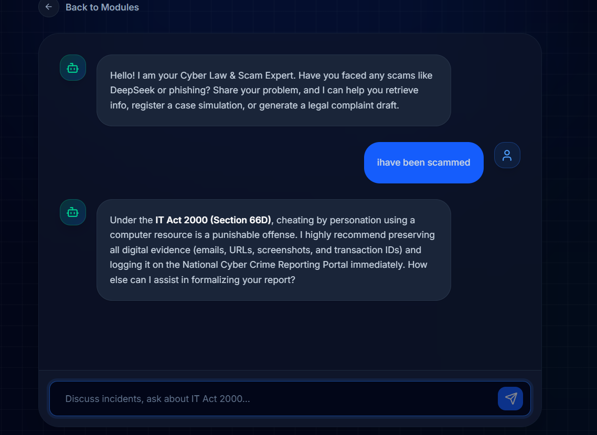
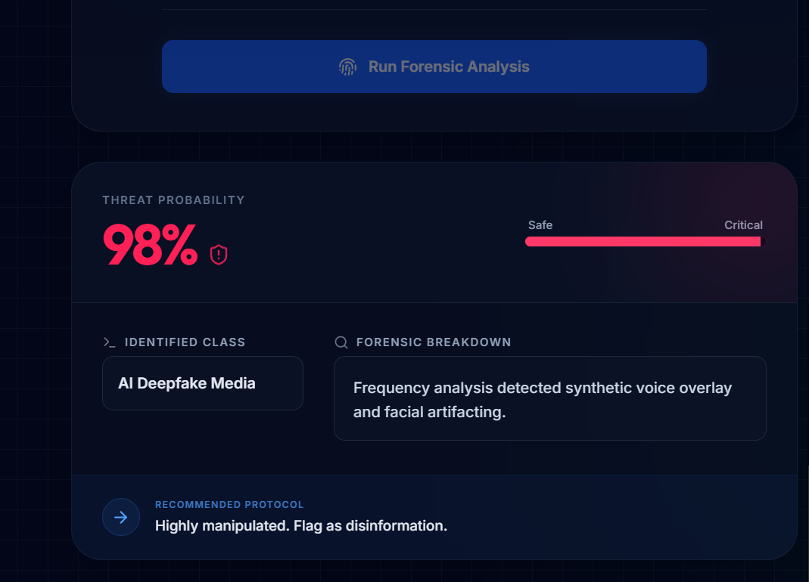
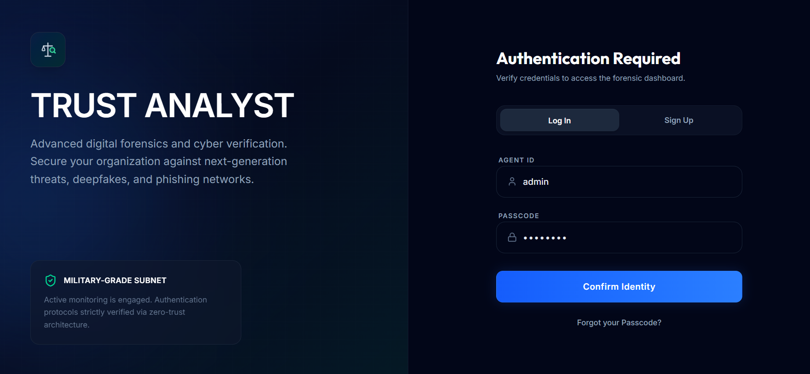
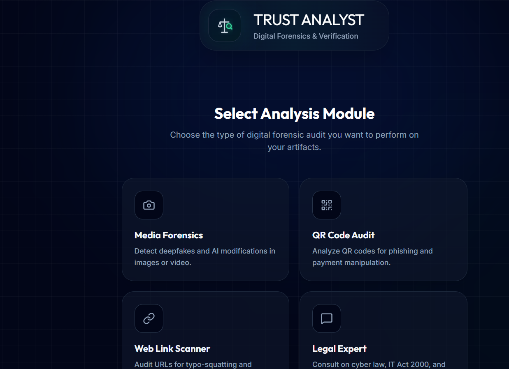

# Project Name

TRUST ANALYST

## Problem Statement
The AI for Cybersecurity & Digital Trust track focuses on building a "verification layer" for the modern internet, specifically targeting the dual threats of synthetic media and adversarial social engineering. By leveraging Gemini's multimodal reasoning, your web app functions as a digital forensic lab that simultaneously inspects visual artifacts—like pixel warping and unnatural blinking in deepfakes—and linguistic red flags, such as the high-pressure urgency and suspicious URL structures found in "Digital Arrest" or KYC scam messages. This approach moves beyond simple detection by providing Explainable AI (XAI) results, which break down the "why" behind a risk score to educate users, effectively bridging the gap between complex technical security and the everyday person’s need for a trusted, verifiable digital environment.

## Project Description
The solution is a Unified AI Trust Engine that acts as a real-time forensic layer between the user and suspicious digital content. Built on a Multimodal Architecture, the web app allows users to upload any file—be it a video of a "government official," an image of a suspicious document, or a text-based KYC scam message.

The system processes these inputs through three specialized detection modules:

Biometric Forensics to identify facial warping and lip-sync inconsistencies in deepfakes.

Linguistic Behavioral Analysis to flag high-pressure psychological triggers and "Digital Arrest" scam patterns.

Metadata & Provenance Verification to check for file tampering or non-official URL structures.

Instead of a simple "Pass/Fail" result, the solution generates an Interactive Trust Dashboard that highlights specific red flags, such as "Inconsistent Eye Reflections" or "Suspicious Domain Registry," providing users with Explainable AI (XAI) that builds long-term digital literacy and security.
## Google AI Usage
google AI is used to check the media,link,qr and also mpcs used in the chatbot
### Tools / Models Used
google gemini 3.1
- 

### How Google AI Was Used
Explain clearly how AI is integrated into your project.

---Forensic Media Analysis (analyzeContent) — Detects deepfakes, QR code phishing (quishing), and cyber-squatting links by analyzing images, QR codes, and URLs.

Cyber Law Chatbot (chatWithScamExpert) — An interactive AI assistant specializing in Indian Cyber Law (IT Act 2000) that can:

Look up known scams (via getScamDatabase tool)
Simulate cybercrime case registration (via registerIndianCyberCase tool)
Generate legal complaint drafts (via generateLegalComplaintDraft tool)

## Proof of Google AI Usage
Attach screenshots in a `/proof` folder:




---

## Screenshots 
Add project screenshots:

  


---

## Demo Video
Upload your demo video to Google Drive and paste the shareable link here(max 3 minutes).
[Watch Demo](#)

---

## Installation Steps

```bash
# Clone the repository
git clone https://github.com/Swalih7736/unified-trust-analyst

# Go to project folder
cd unified-trust-analyst

# Install dependencies
npm install

# Run the project
npm start
